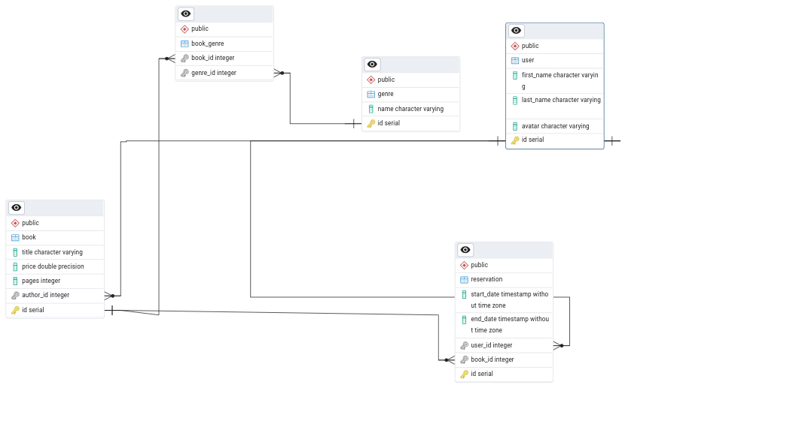

# Book reservations application

## Задание
Создать каталог книг и реализовать REST интерфейс для работы с данными. Должны быть соблюдены Low Coupling и High Cohesion. Реализовать [систему бронирования книги](app/reservation/service.py) пользователем. Пользователь может забронировать книгу на определенное время. Пользователь может не дожидаясь дедлайна по брони отдать книгу обратно; Пользователи не могут забронировать книгу на одну и ту же дату; При наступлении даты окончания бронирования снимать книгу с брони (см. [delete_reservation](app/tasks/tasks.py))
## Условия

Сущность [Book](app/book/model.py) содержит след. поля:

	1. Название
	2. Стоимость
	3. Кол-во страниц
	4. Автора (может быть только один автора)
	5. Жанр (может быть несколько)
Сущность [User](app/user/model.py) (автор) содержит след. поля:

	1. Имя
	2. Фамилия
	3. Аватар

Сущность  [Genre](app/genre/model.py) содержит след. поля:

	1. Название

## Требования

- Спроектировать базу данных (PostgreSQL) руководствуясь сущностями из условий;
- Реализовать CRUD работы с сущностями;
Реализовать фильтр книг (по авторам, по жанрам, по стоимости);
- Архитектура должна быть модульная (например, users, books);
- Подготовить [тестовые данные](app/migrations/versions/a556df013cca_add_test_data.py) для миграции в бд;
- Использование фреймворков FastAPI, Celery;
Реализовать Dockerfile для докеризации приложения и docker-compose.


## Схема базы данных



## Установка и запуск

Скопируйте репозиторий используя следующую команду:

```bash
git clone https://github.com/YuryRass/book_reservations.git
```

Затем перейдите в каталог с проектом:

```bash
cd book_reservations
```

Также в корне проекта переименуйте конфигурационный файл `.env-example` на `.env`:

```bash
mv .env-example .env
```

Для запуска проекта введите команду:


```bash
docker compose up -d --build
```

После запуска можно переходить по адресу: http://127.0.0.1:8000/docs и проверять все endpoint-ы приложения
